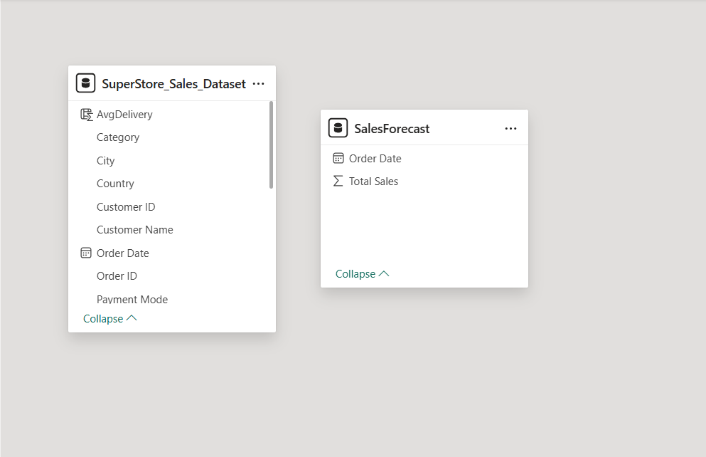

# 📊 Super Store Sales Dashboard

This project is a **data analytics and visualization dashboard** built using the **SuperStore Sales Dataset**.  
It provides insights into sales performance across different segments, categories, regions, payment modes, and shipping methods.  
The dashboard also includes **time-series forecasting** to predict future sales trends.

---

## 🚀 Features

- **Key Metrics Tracking**  
  - Total Sales, Orders, and Customers  
  - Year-over-Year sales growth  

- **Sales Analysis**  
  - By Segment (Consumer, Corporate, Home Office)  
  - By Category & Sub-Category (Office Supplies, Furniture, Technology, etc.)  
  - By Payment Mode (Online, Cards, COD)  
  - By Shipping Mode (Standard, Second Class, First Class, Same Day)  

- **Geographic Insights**  
  - State-wise sales & profit distribution across the U.S.  

- **Trend & Forecasting**  
  - Monthly/Yearly sales performance  
  - Sales forecasting using time-series analysis  

---

## 🛠 Tools & Technologies

- **Power BI** – Dashboard creation & visualization  
- **Excel/CSV Dataset** – SuperStore Sales Data  
- **Forecasting Techniques** – Time-series analysis  

---

## 📸 Screenshots  

### Dashboard Overview  

### Sales Trend & State-wise Insights  

### Data Model  

---

## 🎯 Outcomes

- Identified top-performing **states, categories, and customer segments**  
- Uncovered **seasonal trends and growth patterns**  
- Forecasted sales for **data-driven decision-making**  
- Built an **interactive dashboard** for real-time insights  

---

## 📂 Dataset

The dataset includes details such as:  
- Order ID, Order Date, Customer Info  
- Category & Sub-Category  
- Sales, Profit, and Quantity  
- Payment & Shipping Mode  

---

## 🤝 Contributing

Feel free to fork this repo, suggest improvements, or use the dashboard as a template for your own analysis.

---

## 📬 Contact  

👤 **Madhav**  
🔗 [LinkedIn](https://www.linkedin.com/in/madhavavukkum) | [GitHub](https://github.com/madhavapavan) 

---
